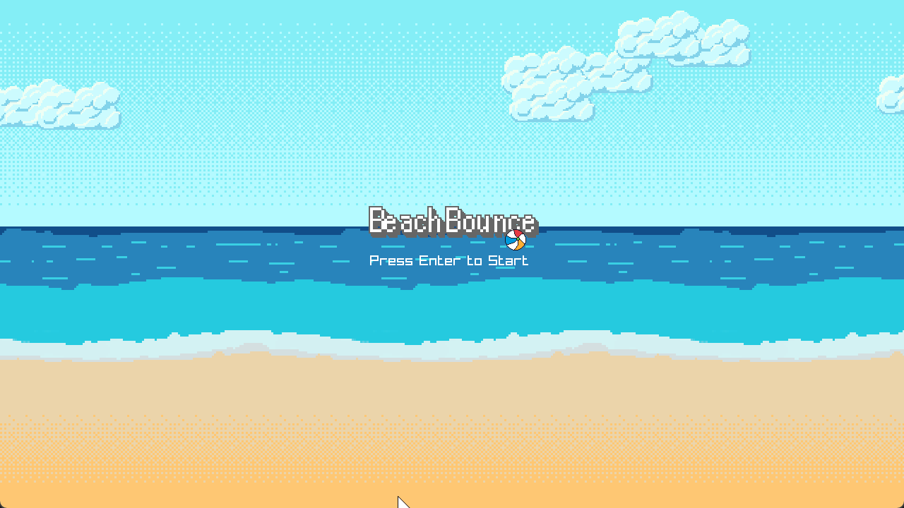
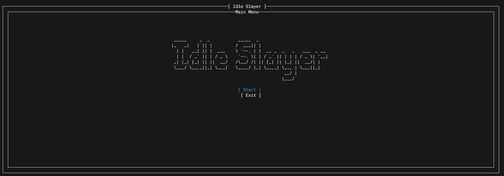
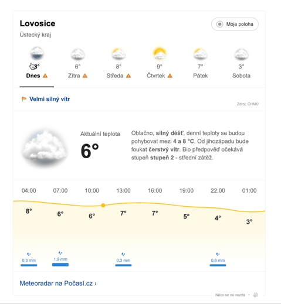

### Hello there 👋
My name is Josef Reichelt and I do coding things.  
I'm a web frontend developer with 4 years of working experience in  but my passion and focus gamedevelopment in .

What I love the most is my son 👦, my wife 👱‍♀️, games 🕹 and game development 💾.

If you would like to contact me, visit my [linkedin.com/in/josefreichelt](https://www.linkedin.com/in/josefreichelt/) or shoot me an email at [pepareichelt@gmail.com](mailto:pepareichelt@gmail.com)

___

# Some things I worked on:  

## Beach Plane
A simple flying and dodge game based on the famous Flappy Bird, made in c++ with raylib.  
[Play on Itch.io](https://protomace.itch.io/beach-plane)  
  

---
## Beach Bounce
A simple bouncing ball game made in c++ with raylib.  
[Play on Itch.io](https://protomace.itch.io/beach-bounce)  
[Project Repo](https://github.com/josefreichelt/proto-kit)  
  

---

## Idle Slayer
A terminal idle game written in C# using the Terminal.Gui library.  
[Project Repo](https://github.com/josefreichelt/idleslayer)  
  

---

## Weather widget
An interactive weather widget that shows general lookout for the following week, current temperature, small text description and a temperature graph that is being rendered in canvas.  

___

# 📖 My Spellbook
Technologies I came to contact or worked with in the past.

## Languages

## Frameworks

## Databases

## Testing

## Gaming

## Tools

# Some more things I worked on

## Hello C.R.U.D.
A simple CRUD application to test out writing an API in C#, Go, Python and TypeScript.
[Project Repo](https://github.com/josefreichelt/hello-crud)  

---

## Internal admin for search-engine
A webapp written in react for searching through large amount of debug information from search engine.  
My role was to write the entire backend and help with frontend

___

## Internal admin web app for tire supplier
A webapp written in react using the next.js framework for managing a tire supplier inventory.  
My role was to write the entire frontend

___

## E-shop car configurator
A webapp written in react using the next.js framework for configuring and purchasing a car.  
My role was to write react components in a team of frontend developers

___

## Internal admin web app for a bank
A webapp written in react for managing and searching through big number of documents.  
My role was to write the entire frontend

